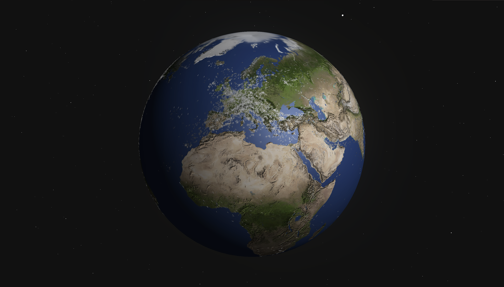

# Real Time 3D Flight Tracker

A 3D visualization that uses AirLab's Data API to fetch flight positions for all currently airborne passenger aircrafts. A simplified airplane 3D model is loaded for each aircraft and the flight positions are converted into spherical coordinates and mapped onto a sphere, that is the earth.

## Tools

- ThreeJS
- AirLab's Data API

## Screenshots

